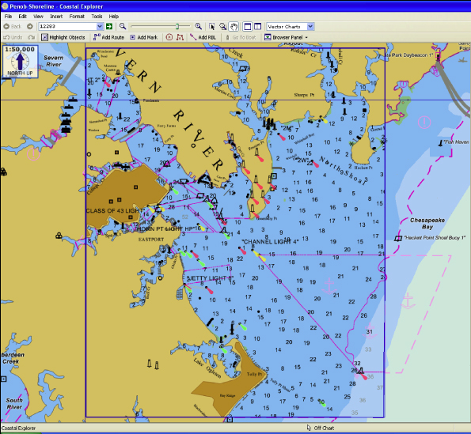

# Fix VMS

The USS Connecticut is an engineering marvel. Its nuclear power plant propels to classified speeds. Its unique hull material secures watertight integrity to classified depths. Its double deck torpedo room services eight torpedo tubes, twice the number found on other submarines. 

In war, it's the apex predator of the ocean. One Seawolf class submarine, such as the Connecticut, can carry 50 torpedoes. Each torpedo can destroy a warship or submarine. The Connecticut has enough firepower to destroy any other nation's nuclear submarine force.

Yet, despite all of this, the navigational software on the $3B warship is far less capable any maps app on your phone. The software, called "Voyage Management System" (VMS), is the hub of all the ship's planning. But it can't even do basic safety-of-ship alerting. 

You want to try and dive down to 350FT even though the seafloor is at 300FT? No problem, VMS will let you do that with no alerting, even though it knows both the ship's depth and the seafloor's depth.

We don't know why the Connecticut hit a seamount. But I'm certain VMS didn't help the watchteam avoid the accident. The Submarine Force has lived with inadequate navigation software for too long. I hope you agree that **it's time we fix VMS.**
## Basics of Planning
Ever wonder how submarines don't hit things? Probably not. But I'm going to cover the basics to show just how poorly VMS supports navigation teams.

```For the submariners, bear with me through some simplifications. ```

One submarine's chunk of the ocean is called its "waterspace." Shore-based offices, like air-traffic controllers, assign submarines waterspace. Once assigned waterspace, a submarine's navigation team plans how to use the space. 

VMS is the hub for all this planning on the submarine. The navigation team takes the waterspace coordinates and manually inputs them into VMS. Then, they build their navigation plans ("nav plans") using the software. These plans have three elements:

1. Location - What is the latitude/longitude?
2. Depth - What are the minimum and maximum operating depths?
3. Time - When is the submarine to be at its location and depth?

What happens if a team gets the plan wrong? Well, if they set the maximum operating depth deeper than the seafloor, a grounding happens. Let's cover how we prevent this from happening. Hint: VMS is of no help.
## How to Not Hit Things
Not hitting the seafloor is really important to submariners. Five people, including the ship's captain, independently review the navigation plans to make sure it doesn't happen. VMS provides no safeguards against operator error.

For instance, submariners have to find the shallowest part of their waterspace. Then, they use the shallowest depth to set depth restrictions. If the shallowest part of the water is 350 feet, they may restrict operations to above 300 feet. 

How do submariners find the shallowest depth in their waterspace? They click around on VMS and look at each depth marker. The shallowest depth marker they spot sets the depth restrictions. The safety of the entire ship depends on a process that looks like this:

1. Submariner looks over a set of depth markers on the map, noting which is the shallowest.
2. Zooms to another portion of the assigned waterspace.
3. Waits for VMS to load the next screen, which can take minutes.
4. Reviews the set of depth markers on the map, noting which is the shallowest.
5. Repeat.


<figcaption><i>VMS looks close to this. Now find the shallowest depth!</i></figcaption>

Despite storing and serving up all of this depth data, VMS does nothing to assist in this review! If the crew erroneously thought that the shallowest point was 350FT, when it was actually 300FT, **VMS would not stop them from planning to drive into the seafloor**. 

## We Deserve Much Better
This failure to intervene is probably the most egregious shortcoming of VMS. But it's notoriously awful along other dimensions. Here's some of what I remember, mixed in with conversations with folks more recently onboard:
* If you zoom in or out, VMS can take minutes to load. This would be the equivalent of scrolling in your maps app and waiting minutes for it to do something. And not like 2-3 minutes--load times could be like "take a coffee/smoke break" long. 
* Essential UI elements could just stop working. The cursor might just freeze up at the worst possible times. 
* When the software crashes, the error messages were unhelpful and required decoding by shore offices. Submarines often go long periods of not communicating with shore offices due to operational requirements.

It's not hard to imagine a navigation system that automatically plots the waterspace assignment messages sent by shore offices. Then, based on the mission profile and environmental conditions, recommends course, speeds, depths to maximize stealth. The planning team could query historic merchant traffic to plan periscope trips around. During surfaced operations, it could recommend visual fix sources and show what they look like to the reviewer. We should be challenging our vendors to come up with something like this, instead of "Can the cursor please not randomly freeze up?"

## Stop Accepting Terrible Software
It's unacceptable work from our vendors and procurement processes, and it's insufficient support of our Submarine Force. Why can't the navigation software of a $3B submarine find the minimum value of an array of numbers? Meanwhile, a $40K car can autonomously navigate city streets, charting a path home with a press of a button. 

Submarine crews are tired of such poor support from VMS, forcing them to burn time reviewing charts with no automated assistance. It's as if our procurement process and the vendor collaborated to absolve themselves from any responsibility by serving us such an aggressively unhelpul tool. One can imagine them thinking, "Well, if we did the most basic alerting and warnings, and a grounding happened, we might get blamed. So let's not do anything."

Instead, it's easier to poorly support our crews, write up "operator error" as the root cause of the accident, and fire crewmembers. What are we doing to engineer software like VMS to help reduce operator error? It's 2021 and our inability to have critical software do basic things is unacceptable. 

## What's Next?
Have other terrible experiences with submarine software? Join me on the "Dolphins Against Bad Software" Discord or leave a comment in the forums.

_The views expressed are those of the author and do not reflect the official policy or position of the US Navy, Department of Defense or the US Government_

